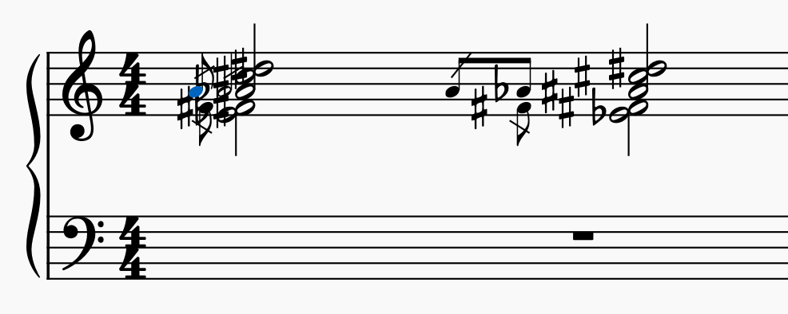
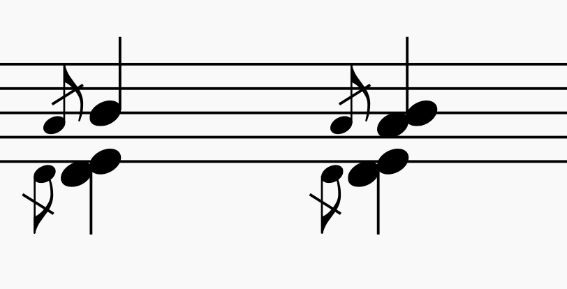

# Microtonal/Xenharmonic MuseScore plugin suite

A plugin to give first-class support as many microtonal/xen notation systems as possible by introducing multiple accidentals per note.

## Features/Goals

- [x] (60%, needs [data entry](#help-needed)) The user should not need to manually retune cents offset of notes. Support for many tuning systems as possible while allowing maximum flexibility of choice of accidentals.

- [x] (90%, needs testing) The user should not need to open up the symbols palette and manually search for the accidental the user needs. Every unique accidental and note in the equave should be accessible with just up/down arrows and 'J' to cycle through enharmonics.

- [x] In large tuning systems, the user should not need to press the up arrow one [gongulus](https://googology.fandom.com/wiki/Gongulus) times to get to the desired note. An auxiliary up/down operation should be provided that transposes to the next note that considers a smaller subset of accidentals and leaves the other accidentals unchanged.

- [x] (80%, needs testing) Accidental ligatures (for HEJI & Sagittal) where multiple accidentals can combine and be represented as a single symbol.

- [ ] Proper transposition by any interval of choice for all regular mappings.

- [ ] MIDI/MPE export with channel pitch bend support.


## Quick Start

> :warning: This project is still a work in progress. It is semi-usable, but I haven't had time to test nor write proper how-tos yet. In the meanwhile, feel free to message me on discord (euwbah#1417), [Telegram](https://t.me/euwbah) or [Instagram](https://www.instagram.com/euwbah/) if you need any assistance.

Download the project as .zip (the green "Code" button on top right of the project page).

Extract files to plugins folder & activate them (see [this guide](https://musescore.org/en/handbook/3/plugins))

Remove the following default keyboard shortcuts in [MuseScore's shortcut preferences](https://musescore.org/en/handbook/3/preferences#shortcuts):

- Pitch up/down or move text/articulation up/down  (`Up/Down` arrow keys)
- Change enharmonic spelling (current mode) (`Ctrl+J`) (optional)

If you wish to use the auxiliary up/down stepwise feature where you can choose exactly which sets/chains of accidentals to change/keep same when transposing, you can also remove/replace these default shortcuts which opens them up to be assigned to the plugin:

- Go to higher/lower pitched note in chord (`Alt+Up/Down`)
- Go to top/bottom note in chord (`Ctrl+Alt+Up/Down`)

**:warning: IMPORTANT:** Assign the following shortcuts using the "Define Shortcut" button in the [Plugin Manager](https://musescore.org/en/handbook/3/plugins#enable-disable-plugins). Having these shortcuts makes up 99.9% of the benefits of this plugin:
 
- `up.qml` & `down.qml` &rarr; `Up/Down` arrow keys
- `enharmonic.qml`&rarr; `Ctrl+J` or `Alt+J`.
  - :warning: If you use `J` as a plugin shortcut, you won't be able to type 'J' when editing text. This is a known issue with MuseScore plugin shortcuts.
- `tune` &rarr; `Alt+R`
- `up/down aux1.qml` &rarr; `Alt+Up/Down`. (Optional, if using aux1)
- `up/down aux2.qml` &rarr; `Ctrl+Alt+Up/Down`. (Optional, if using aux2)

Once you have set all those up, you will need to specify configurations used in your score, such as the [tuning system](#how-to-tuning-configuration), [key signatures](#how-to-key-signatures) (if any), or whether to always use explicit accidentals.

You can configure these by adding a System Text or Staff Text element containing configuration text. These texts don't have to be visible (you can press `V` to toggle visibility).

A System Text configuration will affect all staves, whereas a Staff Text configuration will only affect the staff it is on.

A configuration is only applied to notes from that bar onwards.

You can place configuration texts over multiple staves and bars to write a piece where different parts use different tunings/notation systems, and each part can change tuning/notation system at any bar.

After entering new notes, remember to press `Alt+R` to tune notes to the correct pitch. If you use up/down/J keys, the modified notes will also be tuned.

Copy & read the [example tuning configuration](#case-studyexample).

Read [how the plugin conceptualizes tunings & accidentals](#how-to-understand-this-plugin) to make your own tuning configurations.

## [List of Supported Symbols](https://docs.google.com/spreadsheets/d/1kRBJNl-jdvD9BBgOMJQPcVOHjdXurx5UFWqsPf46Ffw/edit?usp=sharing)

This is still a work in progress. Free for all to edit, and [in need of community contribution](#help-needed)!

#### Keeping accidentals up to date

While the accidental data entry project is in progress, the new accidentals will be supported. The included `tabulate_accidentals.py` script updates your local copy of supported accidentals according to the "CSV Export" sheet. If you don't want to repeatedly download the plugin files to update the list of supported accidentals, you can just run this python script yourself with Python 3. (Though, it is recommended to keep your plugin updated as there are ongoing bugfixes etc...)

Note that if you have been using Symbol Code numbers to refer to your accidentals, you may need to ensure that the Symbol Codes still refer to the same accidentals after updating the list of supported accidentals. While the data entry is ongoing, the Symbol Code of symbols may change and is unstable.

## How to understand this plugin

> 🟢 To use this plugin to its full potential, we first need to know how this plugin conceptualizes & represents accidentals. If you are lazy to read, skip to [here](#how-to-tuning-configuration) to see tuning configuration examples. Though, it is highly recommended that you read this section first.

A **symbol code** represents a visually unique symbol, which could have multiple different IDs under the hood. For the purposes of this plugin, all similar-looking symbols are considered the same symbol.

This plugin only uses accidental symbols from the 'Symbols' category in the Master Palette (shortcut 'Z'). This is because, you can only have one Official Accidental&trade; per note, but you can attach multiple 'Symbols' to visually convey multiple accidentals on a note.

To refer to a symbol when keying in tuning/key signature configuration texts, you can either use the Symbol Code number (the 'Symbol Code' column of the [spreadsheet](#list-of-supported-symbols)), or by the Text Code representation (in the 'Text Code' column).

> When entering symbols, both `#` and `5` both refer to the same sharp symbol.

All this while, those who wish to write in notation systems where multiple accidentals can belong to a single notehead have been manually formatting/drag-dropping/tuning each accidental, with no easy way of simply pressing up/down to cycle through the different accidentals/pitches required. This includes composers who write in [HEJI](https://en.xen.wiki/w/Helmholtz-Ellis_notation), [HEWM](http://tonalsoft.com/enc/h/hewm.aspx), [Sagittal](https://en.xen.wiki/w/Sagittal_notation), [Johnston JI](https://www.kylegann.com/BJNotation.html), [Rank 2/3/+ tunings](https://en.xen.wiki/w/Ups_and_Downs_Notation_for_Rank-3_JI), [very large edos](https://en.xen.wiki/w/Syntonic-rastmic_subchroma_notation), etc...

However, most, if not all, notation systems have one thing in common: an accidental always refers to the same-sized interval offset. A sharp always affects a note by the same amount no matter what other accidentals may be on the note, and no matter what note in the octave/equave it is.

Now, when we say "sharps and flats", these accidentals represents a chain of accidentals along a spectrum. For the purpose of this plugin, let's call it the **accidental chain**. Each successive item in this chain of sharps and flats refer to a constant-sized pitch increment. The number of increments of the unit interval is called the **degree** of the **chain**. `#` (sharp) is "degree 1", and `bb` (double flat) is "degree -2" of the sharps-flats chain.

In 12edo, each degree along the sharps/flats chain represents a 100 cent increment, so `bb` represents -200 cents. We can theoretically extend this chain indefinitely to include as many sharps and flats as we want. However, there aren't any symbols available for more than 3 sharps/flats.

With this plugin, that is not an issue as you can compose different symbols together to form a degree. To do this, connect the Text Codes or Symbol Codes with a period (`.`).

> If you need degree -5 on your sharps-flats accidental chain &mdash; i.e. a 5-flats accidental &mdash; you can specify `bbb.bb` (Text Codes) or `8.7` (Symbol Codes). The order which you specify the symbols will affect which symbol is on the left or right. In this case, the triple flat is on the left, and double flat on the right.

You can't attach two accidental degrees from the same accidental chain on to a single note (like how it wouldn't make sense to call a note "C-sharp-double-flat-triple-natural"). The plugin will simply just not work.

If you want to combine accidentals, they have to be from different accidental chains. You can specify as many accidental chains as you need in this plugin, as long as the symbols used in each accidental chain are mutually exclusive.

> E.g. in Helmholtz-Ellis Just Intonation notation, our pure classic major thirds (5:4) have to be notated as a 'ditone' (81:64) that is lowered by a syntonic comma (81:80) to arrive at a classic major third (5:4). 
> The interval between D and F# is a ditone. This means, if we want the (5:4) interval between D and F, we need to spell it as `F#\` (F sharp syntonic comma-down)
>
> Here, we are combining accidentals from two different accidental chains. The +1 degree from the sharps-flats chain, and the -1 degree from the syntonic commas chain (which we usually use up/down arrows to denote).
>
> To support this 5-limit HEJI notation, we simply need to declare 2 accidental chains. One for sharps-flats for the apotome (2187:2048), and one for arrow ups/downs for the syntonic commas (81:80)

This plugin enables an **infinite** number of notation systems by giving you free-reign over declaring:

- Any number of accidental chains with regular or irregular step sizes between each degree
- Accidentals (that can be composed of any number of symbols) that represent a single degree on an accidental chain.
- The tunings of the nominals (A, B, C, D, etc...)
- The number of nominals within an octave/equave (you can notate Bohlen-Pierce & other systems with less/more than 7 'alphabets')
- The interval of the 'equave' (you can have stretched octave/tritave/etc... tunings, or even _negative-sized equaves_ to notate negative clefs for avant-garde 21st century negative harmony stuff)
- Accidental ligatures --- where a single symbol (or multiple) can represent & substitute for a combination of accidentals from differing accidental chains (useful for HEJI & Sagittal)

## How to: tuning configuration

## How to: key signatures

## HELP NEEDED!

This project is still a **work in progress.**

One of the main features of this project is to allow the user to define their own
accidentals by combining any number of accidentals and symbols to represent one logical accidental.

However, in MuseScore, most accidental symbols have multiple internal IDs of accidentals that represent the same, or a similar-looking symbol.

I need help with tabulating the [list of all accidentals](https://docs.google.com/spreadsheets/d/1kRBJNl-jdvD9BBgOMJQPcVOHjdXurx5UFWqsPf46Ffw/edit?usp=sharing) available in MuseScore, such that Symbol IDs (`SymId`) & Accidental IDs (`AccidentalType`) that point to the same/similar-looking symbol are grouped together.

<br>

There are two categories of accidentals & IDs I will need help to tabulate together.

First, accidentals symbols marked as "Accidentals" in MuseScore's palette. These are the `AccidentalType`s identified internally using the `UPPER_SNAKE_CASE` naming convention.

**These are of low priority**, as the plugin does not intend to use these, at least for the foreseeable future. However, it would be good to get a full tabulation done as this would serve as a useful dataset for the community to do other projects in the future.

Unfortunately, there's no way of extracting their IDs from MuseScore UI, but _msfp_ has kindly provided [this tool for looking up symbols and their IDs](https://musescore.org/en/node/341701#comment-1164436). Download the .zip from the link and open the .html file to access the lookup/symbol search tool.

<br>

The other type of accidental symbols are the ones in the "Symbols" category, identified internally under `SymId` using the `lowerCamelCase` naming convention. These are accidentals used when you need more than one accidental per note (or when MuseScore only supports this accidental 'symbolically').

**High priority: all SymId/SMuFL IDs must be accounted for.**

<br>

The task at hand is to simply ensure all `SymId`s (and optionally, `AccidentalType`s) are represented in the document, and that all `SymId`s/`AccidentalType`s that point to a similar-looking accidental are grouped together on the same row.

For more info on this project, see [this post](https://www.facebook.com/groups/497105067092502/permalink/2700729770063343/).

## Config example: irregular steps

For whatever reason, if you wish to irregular intervals between accidentals within one accidental chain, you can do so with this syntax:

```txt
b.b(-50) bbb bb b (100) # x(25) #x x.x
```

This declares an accidental chain ranging from 2 double flats to 2 double sharps.

The `(-50)` symbolizes that the two double flat `b.b` accidental is 50 cents lower than what it should be. Hence, it signifies -450 cents.

Similarly, the `(25)` symbolizes that the double sharp `x` accidental now refers to 225 cents.

**There should not be a space between the accidental notation and the `(cent offset)`**

If you have a chain of accidentals that are completely irregular, what you can do is to set the generator interval to 0, and specify manual offsets for each accidental:

```txt
b^(-90) v(-50) (0) ^(30) ^2(70)
```

This sets the b^ accidental to -90 cents, v to -50 cents, and so on.

However, do note that if you're using this feature, you're either dealing with a really, complicated/obscure tuning system (8th-32nd harmonics scale stretched by pi?), or you're doing something wrong.

Reasonably sized regular temperament & JI subsets should be representable with only regularly-generated accidental chains.

If you require accidental ligatures where some individual symbols represent accidentals from multiple chains (like in HEJI & Sagittal), you should use the accidental ligature feature instead.

-----

## Config example: accidental ligatures

For proper HEJI and Sagittal notation, we need to take into account that there are combinations of accidentals that can combine into one single symbol.

For example, the sharp and syntonic comma up (ARROW_UP) accidentals can combine into `SHARP_ARROW_UP`.

The solution here is to allow the user to specify a list of ligatures/replacement symbols that apply to specific accidental chains only.

For example, we can have 7-limit JI with 3 accidental chains: apotomes, 5-commas and 7-commas.

In HEJI, there are composite accidental ligatures for compositions of apotomes and 5-commas. The user can append the following text to the Tuning Config text annotation:

```txt
lig(1,2)
<acc chain 1 degree> <acc chain 2 degree> <SymbolCode(s)>
1 3 23
1 2 24
1 1 25
1 -1 26
1 -2 27
1 -3 28
```

`lig(1,2)` signifies that the plugin should perform search-and-replace for exact matches regarding the 1st and 2nd accidental chains only (which are apotomes and 5-commas respectively).

`1 3 23` signifies that the ligature `SHARP_THREE_ARROWS_UP` (SymbolCode 23) is to be applied to replace the symbols that compose the degrees 1 and 3 for the 1st and 2nd accidental chains respectively.

> :warning: The ligature degrees must be stated in order of which the accidental chains are declared in the ligature. If you specify `lig(2,1)` in the first line instead, then `1 3 23` denotes degree 1 for the **second chain**, and degree 3 for the **first chain**.
>
> **You cannot reuse Symbol Codes** that are already being used in any accidental chain. Each symbol of a ligature must be unique from symbols in other ligatures and accidentals.

This means that if some note has an accidental vector of `[1,3,2]` (sharp + 3 syntonic commas + 2 7-commas). The plugin will find that there is an exact match in the 1st and 2nd chains of `[1,3,2]` to the `1 3` ligature vector, and thus the `1 3` part gets ligatured as SymbolCode 23 (`SHARP_THREE_ARROWS_UP`).

Hence, the resulting combination of symbols on the note should be sharp-3-arrows (`[1, 3, 0]`) + 2 7-commas up (`[0, 0, 2]`) = `[1, 3, 2]`.

You can also specify Text Codes in place of SymbolCode numbers (e.g. `#^3` instead of `23`).

If you require a ligature that consists of more than one symbol, separate `SymbolCode`s with a dot (`.`). E.g., `1 3 #.^3` will ligature `[1,3,2]` into `SHARP` + `NATURAL_THREE_ARROWS_UP` + 2 7-commas up. (Though, this is an impractical example).

> :warning: Note that ligatures are not a replacement for specifying symbols for each degree in an accidental chain. You can only apply ligatures to degrees in a chain with symbols assigned to them.

If you require more than one ligature declaration between any number of accidental chains, the user can do so by appending more `lig(x,y,z,...)` declarations below.

E.g.:

```txt
lig(1,2)
1 1 108
1 -1 109
etc...
lig(2,3)
etc...
lig(1,2,3)
etc...
```

The ligatures will be searched and replaced in the order of which they are declared.

The above example will first try to find matches between chains 1 and 2. If a match is found, it will no longer search for further ligatures involving chains 1 and 2, since they have been replaced.

Then, ligatures for chains 2 and 3 will be searched. Again, if there's a match, any further ligatures involving chains 2 and 3 will not be in use.

Finally, neither ligature has matched so far, then ligatures involving all 3 chains will be searched.

I don't think you should use a notation system that would require this much complexity though...

## Caveats

- Does not intend to use the standard Accidentals at all. Accidental symbols used/created by the plugin are cosmetic symbols from the "Symbols" category of the Master Palette. This means:
  - You cannot drag accidentals from the "Accidentals" palette. All accidentals used must be from the "Symbols" category in the Master Palette.
  - Existing scores not made by this plugin will not work with this plugin.
  - Accidentals on grace notes can't be made smaller.
  - Formatting may look weird as this plugin has to reconstruct how accidentals are to be positioned.
- Only concert pitch display mode is supported. If you wish to write for transposing instruments in its transposed key, put the score in Concert Pitch mode and use a Staff Text to enter a Tuning Config such that the tuning frequency matches the transposition of the instrument.
- Does not fully support cross-staff notation. Accidentals don't carry over between two different staves if cross-staff notation is used. However, you can specify all accidentals explicitly.

#### Smaller caveats

- After you open MuseScore, the first time you run any function of this plugin, there will be a 5-10 second lag. This is normal, [the plugin is loading](https://musescore.org/en/node/306551#comment-1005654).
- Does not differentiate between the order of appearance of accidentals within one note.
- Does not intend to support having the same symbols in two different accidental chains (I am unaware of any notation system that requires this)
- Does not support grace notes occurring _after_ a note. Grace notes occuring _before_ a note are supported.
- Octave 8va/15ma/etc... lines are not supported when non-standard number of nominals are used (e.g. bohlen pierce). You can simulate an octave line by setting the reference frequency higher/lower when needed.
- If an undeclared accidental combination is used, the note will be regarded as without accidental, even if some (but not all) symbols are declared in accidental chains.
- Ornaments can only be tuned within +/- 100 cents resolution.
- When exporting MIDI, crescendos/diminuendos do not affect velocity. There doesn't seem to be a simple way to get the velocity of a note from the plugin API.
- Could be very laggy...

-----

# Dev Notes
### Feature target (for now)

- Multiple accidental symbols (using symbols attached to a note) functioning as a single accidental.
- any number of nominals + custom nominal tuning
- equave stretching (1 equave = 1 cycle of nominals)
- custom accidental tuning
- declare a finite number of accidental permutations using chains of accidentals to support rank-N tunings & JI subgroups. (up to 1 accidental per chain can be present on a note).
- Allow irregular step sizes within a single accidental chain.
- transpose up/down to the nearest pitch
- enharmonic respell
- a list of copyable tuning configs of commonly used tunings for beginner users.

## Case Study/Example

This tuning system/staff text specifies a 315-note subset of 2.3.5 JI:

```txt
A4: 440
0 203.910 294.130 498.045 701.955 792.180 996.090 1200
bb.bb 7 bb b (113.685) # x 2 x.x
\.\ \ (21.506) / /./
```

- `A4: 440`
  - Chooses the 12edo nominal A4 as the reference note, sets A4 to 440hz.
  - Because of how this plugin works, the tuning note must be without accidental (it has to be a nominal)
  - **Do not suffix this line with 'hz'**
- `0 203.91 294.13 498.04 701.96 792.18 996.09 1200`
  - Sets a cycle of 7 nominals extending upwards/downwards from A4.
  - Tunes 7 nominals to 203.91cents, 294.13c, 498.04c, 701.96c, etc... respectively, representing the note names A, B, C, etc... (3-limit JI)
  - The last number sets equave to 1200c.
- `bb.bb 7 bb b (113.685) # x 2 x.x`
  - Declares a chain of accidentals that goes: two double-flats, triple-flat (accidental code `7` according to the [spreadsheet](https://docs.google.com/spreadsheets/d/1kRBJNl-jdvD9BBgOMJQPcVOHjdXurx5UFWqsPf46Ffw/edit?usp=sharing)), double-flat, flat, natural/none, sharp, double-sharp, triple-sharp (accidental code `2`), two double-sharps.
  - Each step in the flat/sharp direction lowers/raises the pitch by 113.685 cents respectively. It is also possible to have irregular sizes for different accidentals in a chain, separate example below.
- `\.\ \ (21.506) / /./`
  - Declares a second chain of accidentals that go double-syntonic down, syntonic down, natural/none, syntonic up, double-syntonic up --- where each adjacent step in the accidental chain is 21.506 cents apart.
  - You can combine accidentals from different chains.

This produces the following `TuningConfig`:

```js
{
  notesTable: { ... NotesTable },
  tuningTable: { ... TuningTable },
  avTable: { ... AccidentalVectorTable },
  stepsList: [ ... StepwiseList ],
  stepsLookup: { ... StepwiseLookup },
  enharmonics: { ... EnharmonicGraph },
  accChains: [
    {
      // Accidental chain of bb.bb, bbb, bb, b, etc...
      degreesSymbols: [
        [7,7], [8], [7], [6], null, 
        [5], [4], [3], [4,4]
      ],
      symbolsUsed: [7,8,6,5,4,3],
      tunings: [
        -454.74, -341.055, -227.37, -113.685, 0, 
        113.685, ...
      ],
      centralIdx: 4
    },
    {
      // Accidental chain of \.\ \, \, /, /./
      degreesSymbols: [...],
      symbolsUsed: [...],
      tunings: [...],
      centralIdx: 2
    }
  ],
  ligatures: [],
  nominals: [0, 203.91, 294.13, 498.045, 701.955, 792.18, 996.09],
  numNominals: 7,
  equaveSize: 1200,
  tuningNote: 69, // A4
  tuningNominal: 0, // number of 12edo nominals from A4.
  tuningFreq: 440 // Hz
}
```

Note that accidentals in one chain are mutually exclusive. That is, you cannot have two different accidentals within the same chain applied to the same note. Following this e.g., you can't have flat and sharp on one note at the same time.

Declaring the chain of accidentals sets the search space of the stepwise 'up/down' action such that only the declared accidentals are regarded. (too many declared accidentals/chains/nominals will cause lag / OOM)

When declaring cent intervals of nominals & accidentals, state to as many decimal places as possible. At least 3dp, recommended > 4dp. This is to reduce floating point errors.

Multiple symbols can logically represent one accidental. To do this, connect multiple accidental codes with a dot (`.`). **Do not put a space between dots and symbols**.

For example, `x.+./` declares a single accidental that comprises a double-sharp, a Stein semisharp, and an up arrow. When this accidental is constructed by the plugin, it will have these symbols follow this layout in this order left-to-right, but internally, there is no difference in the ordering of these symbols and they can appear in any order and be tuned the same.

Even if you declare a multi-symbol accidental, these individual symbols cannot be used in the accidentals within any other accidental chain. This is a user-constriction put in place to reduce lag & computation complexity.

E.g. if you declare `x.+./` in chain 1, you cannot declare `x.d` in chain 2, because `x` is already being used by chain 1.

## Implementation Details

### Overview

`tune.qml`:

1. Parse tuning text annotation to construct the 'TuningConfig`.
2. Using key signature annotations, implicit & explicit accidentals, calculate the effective accidental applied on to a note. Explicit > implicit > key signature.
3. Calculate cents interval (from tuning note) of the original 12edo note.
4. Look up the `TuningConfig` for cents interval (from tuning note) for microtonal tuning.
5. Subtract the xen tuning cents from the original cents to get the cents offset.
6. Apply cents offset.

`up/down.qml`:

1. Parse tuning text annotation to construct the `TuningConfig`.
2. The up/down operation should move the current selected note(s) stepwise to the nearest `XenNote` in the `TuningConfig` that is **not** enharmonically equivalent. It should also choose the enharmonic spelling with the minimal number of required explicit accidentals.
   - Explicit accidentals are aggresively created to prevent the modified note from affecting succeeding notes' accidentals.
   - At the end of each bar/selection remove unnecessary accidentals within a bar.
   - At the end of each bar/selection, auto-position accidentals & fix colliding symbols & grace notes.
3. Update the note using to reflected changes to the new note
4. Apply the same method as `tune.qml` to tune all the notes in selected bars (including the unselected parts of the last bar).

`enharmonic.qml`:

1. Parse tuning text annotation to construct the `TuningConfig`.
2. All enharmonically equivalent spellings are indexed/logically grouped together in the `TuningConfig` using the `EnharmonicGraph`.
3. Cycle enharmonic spellings by index using the lookup table.
4. Perform the same housekeeping, checks & formatting as `up/down.qml`.


`aux up/down.qml` / `aux2 up/down.qml` etc...:

Same as `up/down.qml`, except that it will skip user specified accidental chains for each auxiliary up/down action.

Let's use the current 2.3.5 JI subset example:

Assume we configure aux up/down to disregard the syntonic comma accidental chain and only regard the sharps/flats chain.

Then, upon executing 'aux up' on the note `A/`, it should skip all the way to `Gx/`, followed by `Dbbbb/`, `Fxx/`, `Cbb/`, etc... because those are the next nearest `XenNote`s in the `TuningTable` which have an identical syntonic comma accidental. This way, the user can move a note up/down in bigger increments, while preserving existing accidentals.

We can also make clones `aux2 up/down.qml` etc... which work the same way with individually configurable accidental chains. This way, the user can declare multiple up/down arrow key shortcuts (home/end, pg up/pg dn, etc...), where each shortcut increments a different sized step. Very useful for large tunings.

### Construction of `TuningTable` & `TuningConfig`

Upon parsing the above example of the 2.3.5 JI subset tuning config, the plugin should generate the `TuningTable`. This contains all permutations of nominals and accidentals within an equave and sort it in ascending pitch order like so:

```csv
NoteName,  cents,  equavesAdjusted
A      ,   0.00c,  0
Dbbbb\\,   0.29c,  0
Gx\    ,   1.95c,  -1
Fxx\\  ,   3.91c,  -1
Bbb//  ,  19.55c,  0
A/     ,  21.51c,  0
Dbbbb\ ,  21.79c,  0
Gx     ,  23.46c,  -1
Cbb\\  ,  23.75c,  0
Fxx\   ,  25.41c,  -1
A//    ,  43.01c,  0
Dbbbb  ,  43.30c,  0
Gx/    ,  44.97c,  -1
Cbb\   ,  45.25c,  0
Fxx    ,  46.92c,  -1
Bb\\   ,  47.21c,  0
Dbbbb/ ,  64.81c,  0
Gx//   ,  66.47c,  -1
Cbb    ,  66.76c,  0
Fxx/   ,  68.43c,  -1
Bb\    ,  68.72c,  0
A#\\   ,  70.67c,  0
Dbbbb//,  86.31c,  0
Cbb/   ,  88.27c,  0
Fxx//  ,  89.93c,  -1
Bb     ,  90.22c,  0
A#\    ,  92.18c,  0
G#x\\  ,  94.13c,  -1
... etc (see 2.3.5 JI tuning example.csv for all 315 notes)
```

This `TuningTable` is the common resource that exhausts all possible unique spellings of the nominals, and belongs to the `TuningConfig`. It is implemented as a mapping from `XenNote`s to cent offsets.

During the parsing of tuning, the `TuningConfig` needs to index the `TuningTable` several ways so that we can quickly obtain required information in O(1) time.

- `notesTable`: maps `XenNote` string hashes to `XenNote` objects
- `tuningTable`: maps `XenNote` string hashes to cent offsets
- `avTable`: maps `XenNote` string hashes to `AccidentalVector`s
- `stepsList`: a list of collated sets of enharmonic-equivalent `XenNote` string hashes, sorted by increasing pitch
- `stepsLookup`: maps `XenNote` string hashes to the index it appears in the `stepsList`
- `enharmonics`: maps `XenNote` string hashes to enharmonic equivalent `XenNote` string hashes.
- ~~a mapping of cents to note name~~ (no use case yet)

We also need to store the accidental chains in the order which they are declared.

### Accidental Support

This plugin only intends to support/use accidentals that are regarded as 'Symbols'

This means, the usual accidentals from the "Accidentals" palette will not be used and ignored.

Accidentals used by this plugin are to be from the "Symbols" category in the Master Palette, and these symbols are the complete list of SMuFL symbols available, which is more exhaustive than MuseScore's "officially supported" accidentals.

The reason for this decision can be explained with the following case study:

On beat 1: enter a Db with an official flat symbol

Beat 2: enter a D sagittal 7 comma up via the "symbols" palette

Beat 3: enter the same D 7 comma up but using the "officially supported" accidental symbol from the Accidentals palette.

To the plugin, the second note will appear as Db with a 7 comma up symbol. This is because MuseScore does not naturalize a note if the symbol attached to it isn't regarded as an accidental.

The third note will appear as a D natural internally, with a 7 up accidental attached to it as a legitimate accidental.

However, logically speaking, by default, an accidental present should override any prior accidentals. Let's say we account for this and tune the second note 100 cents sharper to account for the 'phantom' flat accidental.

Now, if the second note were to actually instead be a Db with both the flat and sagittal symbols attached to it, the internal representation of the note would be exactly the same as a D without the flat, because internally, the prior Db on beat 1 affects the TPC of the second note.

This means that in this scenario, the two different notes would be indistinguishable and impossible to tell apart.

And there is simply no way for this plugin to tell apart whether that note should have been a Db or a D.

For this reason, this plugin will not aim to support standard MuseScore accidentals and will always use SMuFL symbols from the "Symbols" category of the Master Palette.

### Tokenizing of explicit accidentals

Let's continue the example using the same tuning system as above with two accidental chains, 7 nominals, and tuning note set to A4.

Here's an example of the parsing of `Ebbbb\\4`. Let's assume that the first double flat is a Full Accidental, and the second double flat is a Symbolic Accidental. (You cannot have more than one Full/Half Accidentals on the same note) The double flat is accidental code 6.

Let's also assume that the comma down is the `accidentalArrowDown` SMuFL (Gould arrow) symbol, which looks like an arrow pointing straight down. Let's say it is represented by accidental code 34 (not finalized yet).

Hence, this note's `tpc` is 3 (E double flat), and it has three Symbolic Accidental attached under the `elements` property. In no particular order: double flat, comma down, comma down.

Note that this plugin does not factor the order of appearance of accidentals. That is, `Ebbbb\\` is the same as `E\bb\bb`.

The `tokenizeNote()` function 'tokenizes' the MuseScore Note element to output the following `MSNote` object:

```js
// MSNote
{
  midiNote: 62, // playback pitch is D4 (Ebb)
  tpc: 4, // Ebb is 4
  nominalsFromA4: -3, // E4 is 3 nominals below A4.
  accidentals: {
    6: 2, // two double flats
    34: 2, // two comma downs
  }
}
```

### Tokenizing of implicit accidentals

Let's say immediately after the above `Ebbbb\\` note, we have a `E` with no accidentals.

This note's `tpc` is still 4 (Ebb), because the Full Accidental is still in effect from before. However, it has no explicit accidentals attached to it.

In this situation, we need to check for prior notes in this staff line with explicit accidentals using the `getAccidental` function. This function returns the `accidentals` object of a preceding note with explicit accidentals that affect the current one, or `null` if there are no prior notes with explicit accidentals.

As of now, this plugin does not intend to support the ability to have independently explicit/implicit accidentals per accidental chain. This means that ups and downs notation where prior sharps/flats carry through an up/down accidental will not be supported. If there's enough demand for that, then this feature will be a goal.

### Parsing a note

Once the implicit/explicit accidentals on a `MSNote` has been tokenized, we apply information from the TuningConfig to calculate the `XenNote` string hash from properties of the `MSNote`. Then, we can obtain `NoteData` from the `XenNote` + equaves calculation.

Example `NoteData` of the above `Ebbbb\\4` note with implicit accidentals.

```js
{
  ms: { // MSNote
    midiNote: 62, // D4 (Ebb)
    tpc: 4, // Ebb is 4
    nominalsFromA4: -3, // E4 is 3 nominals below A4.
    accidentals: null, // no explicit accidentals
    tick: 480, // tick position of note
    line: 3, // Note.line property (not actual value, just an example)
    internalNote: Ms::PluginAPI::Note // internal MuseScore Note object
  },
  xen: { // XenNote
    nominal: 4, // E
    accidentals: {
      6: 2, // two double flats
      34: 2, // two comma downs
    },
    hash: "4 6 2 34 2"
  },
  equaves: -1 // E4 is in the equave below tuning note A4
}
```

### Cents offset calculation

To calculate the tuning offset to apply to a note, we calculate the xen interval from the reference note, and the 12edo interval from the reference note, then we subtract the 12edo cents from the xen cents to get the offset.

```js
function calcCentsOffset(noteData, tuningConfig) {
  // lookup tuning table [cents, equavesAdjusted]
  var cents_equaves = tuningConfig.tuningTable[noteData.xen.hash];

  // calc cents (from reference note) of XenNote spelt in equave 0
  // remember to include equave offset (caused by equave modulo wrapping)
  var xenCentsFromRef = cents_equaves[0] + cents_equaves[1] * tuningConfig.equaveSize;

  // apply NoteData equave offset.
  xenCentsFromRef += noteData.equaves * tuningConfig.equaveSize;

  // calculate 12 edo interval from reference
  var standardCentsFromRef = 
    (noteData.ms.midiNote - tuningConfig.tuningNote) * 100;

  // the final tuning calculation is the difference between the two
  return xenCentsFromRef - standardCentsFromRef;
}
```

Because of all the lookups, tuning a note is O(1) and should be performant.

### Choosing the next note

In `(aux) up/down.qml`, the plugin should be able to choose the next stepwise note up/down from the current given note.

The `chooseNextNote()` function returns a list of `[XenNote, nominalOffset]` tuples of enharmonically-equivalent spelling options for the next stepwise note.

### Accidental display order

As part of `up/down/enharmonic.qml`, the plugin should be able to create, modify and delete accidental symbols and attach them to the note.

The accidentals should appear in the order which the user declared them.

- Sort right-to-left in order of accidental chain declaration. Right-most symbols (closest to the notehead) belong to the first accidental chain.
- Ligatured symbols take the place of the highest-priority accidental chain included in `regarding` (they should take the place of the right-most symbol it replaces)
- Multi-symbol accidentals appear left-to-right in the order the user declared them.
  - E.g. `b./` should appear as flat on the left, up arrow on the right.

If multiple enharmonic equivalents are available, the plugin should choose the enharmonic spelling with the least number of symbols.

### Updating a note

In `(aux) up/down.qml` and `enharmonic.qml`, the plugin should be able to update the note's `line` (nominal) and `accidentalType` properties, and update attached symbols in `note.elements`.

This is a VERY involved process:

- Choose an appropriate spelling for the new note (`NextNote`)
- Obtain the proper ordering of `AccidentalSymbols` from `XenNote.orderedSymbols` object
- Ensure the modified note does not affect subsequent notes. Aggressively add explicit accidentals on all notes in the bar that share the same `Note.line` of the original & modified note.
- Update symbols attached to note, update `Note.line`
- At the end of each bar (or selection), remove extraneous explicit accidentals (only if config doesn't specify to keep them in case the user wants to do some post-tonal 23rd century stuff)  The `BarState` object comes in handy as it sorts notes by order of appearance.
- Then, process each tick-chords in the bar into a list of `Chords` objects. Each `Chords` object represents the chords & grace chords of all 4 voices at a single tick position.
- Use the `Chords` object to auto position accidentals.

-----

### Ligature implementation

If ligatures are defined, these will add additional entries to the `NotesTable` when there is an exact match in the degrees of the `AccidentalVector` regarding `considered` accidental chains.

A ligatured entry will contribute additional `XenNote` spellings pointing to the same `AccidentalVector` (+ other lookup entries). There's no need to worry about this many-to-one map because there is no need for an inverse mapping.

With these additional lookup entries, a ligatured spelling is implemented simply as an 'enharmonic spelling', and ligatures can be toggled with the enharmonic cycling operation.

When creating/managing accidentals during up/down operations, this plugin favours spellings with lesser symbols. If for whatever reason, a ligatured spelling has more symbols than an non-ligatured one, the plugin will not automatically use the ligatured spelling. Thus, it only makes sense to define ligatures if the ligatured spellings will always have fewer symbols than the non-ligatured one.

-----


## Auto-positioning & layout

This section describes the methodology of auto-positioning accidentals. This plugin will try its best to position accidentals. However, this is a very ambitious feature, and needs much feedback, testing & help from the community.

### 0. Auto-positioning case study

The auto-positioning function regards all chords at the same tick position at once. Thus, we only need to care about the positioning of accidentals one tick at a time.

However, different voices and grace notes can share the same tick position, so we need to handle the positioning of every voice + grace chords all at once.

Here is an image of non-positioned and positioned versions of the same notes at a single 'tick':



We will use this example to formulate our auto-positioning algorithm.

### 1. Read chords at given tick

We read the contents of one bar at once. Instead of partitioning by `line` which `BarState` does, this time we're partitioning our data into ticks. Gather all the chords with the same tick position into one `Chords` data structure.

The `Chords` object splits chords by voice. Within each voice, the chords & grace chords are sorted right to left, with the main chord first in the list.

The generated data structure of the above example will look like this:

```js
[ // Chords object
  // Voice 1
  [
    [Main chord],
    [Second grace chord],
    [First grace chord]
  ],
  // Voice 2
  [
    [Main chord],
    [First grace chord]
  ],
  // Voice 3&4 empty
  [],
  []
]
```

Within a single chord, the notes are listed in no particular order.

The rationale for sorting right-to-left is so that we ensure that the index of the second grace chord of voice 1 equals the index of the first grace chord of voice 2.

This way, the positioning of grace chords are consistent between voices, and all grace chords that should be vertically aligned have the same index.

This allows us to break down/decompose the process into even smaller steps.

### 2. Per-vertical chord accidentals processing

All vertically-aligned chords (discounting offsets due to clusters of noteheads) are given the same index. Now we process the accidentals of all vertically aligned chords together (regardless of voice).

e.g. Where `k` is the chord index, we concat all the voices together: `Chords[0][k].concat(Chords[1][k]).concat(Chords[2][k])...`

To position accidentals, we use the zigzag pattern: The accidentals for the top most note are positioned closest to the chord as possible, then the bottom most note's accidentals are positioned, then the second-top-most, then second-bottom-most, etc... until all the notes' accidentals are placed.

To accomplish this:

- Fold/flatten the list of vertically-aligned chords so that all the notes are in one list
- Sort the notes in increasing `.line` order (i.e. decreasing pitch, from top to bottom)
- Reorder the list using two pointers.

Once we have the zigzag list, we can 'add' accidentals.

### 3. Populate accidental offsets

We cannot add accidentals as we go along, as adding accidentals one-by-one may cause the position of the elements on the page to change, which means we will need to recalculate the bounding boxes of the noteheads every time we add an accidental.

Instead, we can rely on the fact that the element offsets are consistent relative to the attached notehead. What we can do is to calculate positions for ALL accidentals within the current vertical-chord, and express the positions as offsets from the parent element of each accidental.

By storing offsets, at the end of everything we can assign to offsets to all the accidentals in one go, and everything should work out.

To calculate where should an accidental go, we must take note of the bounding boxes of every fixed element/prior accidentals already keyed-in, and make sure that:

- We do not overlap with any fixed elements/already-positioned accidentals
- The chosen position of the accidental MUST be left of the notehead that the accidental is supposed to belong to.
- If there are multiple accidentals on a single notehead, we sort by increasing z index, the lower z index is positioned first so that it appears on the right side. The symbols of a multi-symbol accidental must always appear adjacent, and cannot be pushed back/interrupted by another accidental.

### 4. How to check overlap

We can check overlap using the `.pagePos` and `.bbox` properties of `PluginAPI::Element` (both noteheads & accidental symbols are elements).

`Element.pagePos` represents the absolute position of the element's origin:

```js
{
  "x":24.269899801587307,
  "y":30.73749507936508
}
```

and `Element.bbox` contains info about how far up, down, left, and right does the element extend from its origin, and where its top-left corner is positioned relative to its origin.

```js
{
  "x":0,
  "y":-1.3359375,
  "width":0.9759375,
  "height":2.6640625000000004,
  "left":0,
  "right":0.9759375,
  "top":-1.3359375,
  "bottom":1.3281250000000004
}
```

From the above two example properties, we can see that the absolute bounding box of the element is:

```js
{
  "left":24.2...,
  "right": 25.2...,
  "top":29.4...,
  "bottom":32.4...
}
```

### 5. Mark accidental(s) position

Using the absolute bounding boxes of fixed/already positioned elements from step 4., we can determine the appropriate X position for an accidental, then mark its position offset:

- Filter out all bounding boxes that are not vertically overlapping with the Y axis of the to-be-positioned accidental. (Use `intervalOverlap()` function)
- Sort bounding boxes by decreasing X position (i.e. from right to left)
- Between every Nth and (N+1)th bounding box, calculate the gap between them. The gap is the distance between the left edge of the Nth bounding box and the right edge of the (N+1)th bounding box.
- If the sum of the widths of bounding boxes of the symbols required in the to-be-positioned multi-symbol accidental can fit within the gap, place them flushed to the left edge of the Nth bounding box (i.e. flushed as right as possible).
- Mark the positioned symbols as 'fixed' so that the next accidentals cannot overlap.
- Calculate the X offset of the positioned symbols relative to the notehead's page position. Remember to account for the symbol's origin offset. (the notehead's X position is equal to its left bounding box edge).

A symbol that is marked as 'positioned' will take this form:

```js
{ // PositionedElement
  element: PluginAPI::Element, // element of the symbol
  top: ..., // absolute coords of bbox top
  bottom: ..., // absolute coords of bbox bottom
  left: ..., // absolute coords of bbox left
  right: ..., // absolute coords of bbox right
}
```

### 6. Assign offsets

Assign the respective calculated X offsets to all the symbols at one go.

### 7. Push back grace notes

The newly positioned accidentals will not push back grace notes/prior grace notes, this will cause positioned accidentals to intersect with grace notes. To fix this, we need to manually push back ALL grace notes by the largest (leftest, -ve) X offset applied in step 6.

We can push back a grace chord by adjusting the note's parent's `Chord.offsetX` property.

As we are iterating each grace chord, we need to keep track of the amount of space pushed back. DO NOT increment a grace chord's offset relative to its present offset, this will cause the offset to repeatedly increase. Instead, we use the `spacePushedBack` variable to keep track of any additional push backs caused by other grace chords on the right.

Also, there are two things to note about how MuseScore positions grace notes by default (even without accidentals):



Firstly, the default X position of each grace note depends on the noteheads of the voice it belongs to. If the voice's main chord has a notehead cluster, the gracenote's default position will be pushed back to compensate for the notehead cluster.

Secondly, notehead clusters/chords in other voices do not affect the positioning of grace chords in other voices.

As a result, we can decide how much to additionally push back a grace note by measuring the left-most symbol's position with respect to the left-most notehead position per voice. The `symbol.pagePos.x - note.pagePos.x` is the amount of space we need to push back all prior grace chords by.

### 8. Rinse and repeat

We can repeat steps 2-7 for the grace notes, calculating accidental offsets relative to grace notes one vertical-chord at a time, until all chords are completed.

## MIDI Export

This plugin 'exports' midi by generating a midi.csv file which contains all play events + tuning information for all notes in the selection/entire score.

This midi.csv file is fed into a Python script which generates one MPE midi file per staff.

### midi.csv format

```csv
ticks per quarter note
staff number, MIDI note, ontime, duration, velocity, cents offset
...
```

The first line contains the number of midi ticks per quarter note, and the second line onwards contains midi play events.

> :warning: To simplify the implementation, there will not be any info about tempo/time signature (and the midi spec will default to 4/4, 120 BPM). When importing the generated midi files into DAWs, make sure to disable auto import tempo information.

## Data Structures

#### `SymbolCode`

```js
number
```

A number representing a uniquely identifiable accidental symbol. A single symbol code maps to all MuseScore accidental enums/SMuFL IDs that looks identical.

[See list of symbol codes](https://docs.google.com/spreadsheets/d/1kRBJNl-jdvD9BBgOMJQPcVOHjdXurx5UFWqsPf46Ffw/edit?usp=sharing)


#### `AccidentalSymbols`

```js
{
  SymbolCode: number,
  SymbolCode: number,
  ...
}
```

Represents accidental symbols attached to a note. Each entry is the SymbolCode of the symbol and the number of times this symbol occurs.

The keys are NOT ORDERED.

The keys are in left-to-right display order as per [accidental display order](#accidental-display-order) determined by Tuning Config.

This object can be hashed into the `AccidentalSymbols.hash`, which can be appended to a nominal number to produce the `XenNote.hash`. The hashed symbols list is sorted by increasing `SymbolCode`.

#### `MSNote`

```js
{
  midiNote: number, // `Note.pitch` property
  tpc: number, // `Note.tpc`
  nominalsFromA4: number, // number of 12edo nominals from A4.
  accidentals?: { // AccidentalSymbols
    // Explicit accidental symbols attached to this note.
    // Not ordered.
    SymbolCode: number,
    SymbolCode: number,
    ...
  },
  tick: number, // tick position of Segment that this note is attached to.
  line: number, // `PluginAPI::Note.line` property.
  internalNote: PluginAPI::Note // official MuseScore note object
}
```

Represents a tokenized MuseScore note element.

If no explicit accidentals are present, `accidentals` is null.

`midiNote` contains the default playback pitch (MIDI note) that MuseScore will use for this note.

Use `getTick(note)` to get value of `tick`.

#### `AccidentalVector`

```js
[number, number, ...]
```

Represents a single abstract composite accidental being applied to a note, represented by the degrees of each accidental chain.

For example, in a tuning system with two accidental chains in this order: sharps/flats, up/down --- the `AccidentalVector` of `[2, -3]` represents the degree 2 of the sharps/flat chain (double sharp) and degree -3 of the arrows chain (three down arrows).

The n-th number represents the degree of the n-th accidental chain. The order of which the accidental chains are declared/stored determines which number corresponds to which accidental chain.

#### `XenNote`

```js
{
  nominal: number, // no. of nominals away from tuning note (mod equave)

  // How to spell the accidental in proper left-to-right order
  // If no accidentals, orderedSymbols is an empty list [].
  orderedSymbols: [SymbolCode]

  accidentals?: { // AccidentalSymbols
    // The spelling of this note according to symbols present.
    // Both Implicit & Explicit accidentals must be represented.
    SymbolCode: number
    SymbolCode: number,
    // if a tuning-declared accidental is not present in this note,
    // do not add it
    SymbolCode: 0 // DON'T DO THIS.
    ...
  }
  hash: string, // for lookup purposes
}
```

Think of this as the xen version of 'tonal pitch class'.

This is how the plugin represents a 'microtonal' note, containing data pertaining to how the note should be spelt/represented microtonally.

The `accidentals` object is not sorted. When creating/displaying an accidental, use `orderedSymbols` to iterate each symbol in left-to-right order.

If `accidentals` is null, represents a nominal of the tuning system (note without accidental).

The `hash` string is to save performance cost of JSON.stringify and acts as a unique identifier for this `XenNote`.

`"<nominal> SymbolCode <degree> SymbolCode <degree> ..."`

The `SymbolCode`s in the hash string must appear in increasing order.

For example, the note `A bb d` (1 double flat, 1 mirrored flat) should have the hash string: `"0 6 1 10 1"`.

#### `NoteData`

```js
{
  ms: MSNote, // 12edo representation
  xen: XenNote, // xen pitch class
  equaves: number // no. of xen equaves from tuning note.
}
```

Represents a semantically parsed note after `TuningConfig` lookup is applied to a `MSNote` to calculate its `XenNote` pitch class.

#### `NotesTable`

```js
{
  'XenNote.hash': XenNote,
  'XenNote.hash', XenNote,
  ...
}
```

Contains a lookup for all unique `XenNote`s in a tuning system.

Maps `XenNote.hash` to `XenNote` object.

#### `AccidentalVectorTable`

```js
{
  'XenNote.hash': AccidentalVector,
  'XenNote.hash': AccidentalVector,
  ...
}
```

Contains a map of `XenNote`s to their respective `AccidentalVector`s.

Note that this mapping is not bijective - two `XenNote`s can have different nominals but the same `AccidentalVector`.

NOTE: There doesn't seem to be a use case for an inverse mapping of this yet. However, if it is required later down the line, that would mean a lot of the implementation has to change. Hmm.

#### `TuningTable`

```js
{
  'XenNote.hash': [number, number], // [cents, equavesAdjusted]
  'XenNote.hash': [number, number],
  ...
}
```

Lookup table for the tuning of `XenNote`s. Entries do not need to be sorted in any particular order as the indexing for pitch sorting is done in `StepwiseList`.

See [2.3.5 JI tuning table.csv](https://github.com/euwbah/musescore-ji-rtt-plugin/blob/master/2.3.5%20JI%20tuning%20table%20example.csv) for an example.

`cents`: the number of cents this note is from tuning note modulo the equave.

`equavesAdjusted`: the number of times this note has to be taken up/down an equave so that its cents mapping will fit modulo the equave.

The equave adjustment has to be kept track of so that notes are tuned with in the correct equave, and stepwise up/down operations use the correct equave for certain notenames.

Look at the above 2.3.5 JI subset tuning for an example. (A4 is the tuning note & equave: 1200 cents.)

Going up stepwise from the note `Dbbbb\\` to `Gx\`, we actually need to lower Gx\ by one equave to actually get the correct next note up.

Similarly, going up stepwise from `Fxx\\` to `Bbb//`, we'll need to increase the equave by 1 so that it sounds in the correct equave.

#### `StepwiseList`

```js
[
  // Groups enharmonically equivalent oredered by ascending pitch
  ['XenNote.hash', 'XenNote.hash', ...],
  ['XenNote.hash', 'XenNote.hash', ...],
  ...
]
```

This list of lists indexes the `XenNote` hashes in order of ascending pitch.

Each list represents 'enharmonically equivalent' `XenNote`s. The stepwise up/down plugins uses this to determine what are the possible spellings of the next stepwise note, and it chooses the best option of enharmonic spelling based on the context (use of implicit accidentals/key signature/minimizing accidentals)

#### `StepwiseLookup`

```js
{
  // Mapping of XenNote to index of StepwiseList
  `XenNote.hash`: number,
  `XenNote.hash`: number,
  ...
}
```

A lookup table for the index of a `XenNote` in the `StepwiseList`. This lookup is used to determine the index of a current note, and the next note up/down is simply the enharmonically equivalent `XenNote`s at index + 1 or index - 1 of `StepwiseList`.

#### `EnharmonicGraph`

```js
{
  'XenNote.hash': 'XenNote.hash',
  'XenNote.hash': 'XenNote.hash',
  ...
}
```

A simple lookup table where `EnharmonicGraph[XenNote]` gives the next enharmonic equivalent spelling of the note, or `null` if there are no other enharmonic equivalents.

This lookup table describes a graph composed of several distinct cyclic directional paths. Each cyclic loop represents enharmonically equivalent notes.

This structure is computed at the same time as the `StepwiseList`.

#### `AccidentalChain`

```js
{
  degreesSymbols: [[SymbolCode]?], // Central element is null.
  symbolsUsed: [SymbolCode], // lists all unique symbols used in this chain.
  tunings: [number], // tuning of each accidental in cents. Central elemnent is 0.
  centralIdx: number, // the index of the central element.
}
```

Represents a user declared accidental chain.

Each element of `degreesSymbols` is a list of `SymbolCode`s containing the symbols composed together to represent one degree in the accidental chain (in the order of which the user declared)

The accidental degree of the chain represented by `degrees[n]` and `tunings[n]` is equal to `n - centralIdx`.

`symbolsUsed` is used to determine what symbols are used in this accidental chain. It's not really necessary in this implementation (yet), but is provided as a lookup just in case.

#### `Ligature`

```js
{
  regarding: [number], // acc chain indices (starting from 0)
  ligAvToSymbols: {
    // Search & replace map AccidentalVector -> SymbolCode
    LigAccVector: [SymbolCode],
    LigAccVector: [SymbolCode],
  },
}
```

Represents a ligature declaration.

`regarding` is an unordered set representing which n-th accidental chains to consider when searching for exact `AccidentalVector` matches. (The indices are 0-based)

`LigAccVector` is a subspace of `AccidentalVector` which corresponds to the respective accidental chains included by `regarding`.

#### `TuningConfig`

```js
{
  notesTable: NotesTable,
  tuningTable: TuningTable,
  avTable: AccidentalVectorTable,
  stepsList: StepwiseList, // Sorted by increasing pitch
  stepsLookup: StepwiseLookup,
  enharmonics: EnharmonicGraph,
  accChains: [AccidentalChain], // In the order of decl.
  ligatures: [Ligature], // In order of decl.
  nominals: [number], // List of cents from tuning note
  numNominals: number, // = nominals.length
  equaveSize: number, // = the last cents value in nominals list
  tuningNote: number, // MIDI note number of tuning note
  tuningNominal: number, // tuning note number of 12edo nominals from A4.
  tuningFreq: number, // Hz of tuning note.
  auxList: [[number]], // List of list of indices of accidental chains.
}
```

This is the resulting data structure to be generated after parsing a tuning config staff/system text annotation.

The Nth entry of auxList represents the Nth auxiliary `accChainsToCheckSame` to pass into the `chooseNextNote` function. `auxList[0]` is `null`, representing the default up/down which includes all accidental chains.

#### `TuningConfigLookup`

```js
{
  'staff/system text string': TuningConfig,
  'staff/system text string': TuningConfig,
  ...
}
```

A lookup for memoized parsed `TuningConfig`s. Because of how the plugin cursor API requires each voice to be tuned separately one at a time, it will cause many unnecessary re-parsings of the same System/Staff Text element.

To prevent unneeded parsings, this lookup maps verbatim system/staff texts to the `TuningConfig` it results in when parsed. Hopefully this would reduce plugin lag.

#### `KeySig`

```js
[
  AccidentalSymbols.hash?,
  AccidentalSymbols.hash?,
  AccidentalSymbols.hash?,
  ...
]
```

Contains a list of N `AccidentalSymbol` hashes, where N is the number of nominals in the tuning system.

The Xth hash represents the accidental symbol(s) to be applied by the key signature for the Xth nominal. The first hash corresponds to the nominal as stated by the reference tuning note. E.g. if `G4: 440` is used, then KeySig[0] will be the accidental that applies to G, KeySig[1] applies to A, etc...

If no accidental is to be applied on the nominal, the entry should be null.

**The list is to contain N hash/null entries at all times.** However, because it is impossible to validate whether a `KeySig` declaration has the right number of nominals, validation checks have to be done before attempts to look up the `KeySig`.

#### `ConfigUpdateEvent`

```js
{
  tick: number, // MScore tick, when the config is to be applied
  config: {
    // key-value pairs that will be assigned to the `parms` object
    // when the cursor passes/reaches the given `tick`
    "<keyName1>": value1,
    "<keyName2>": value2,
    ...
  }
}
```

This object represents a single `parms` configuration update event that is to be executed when (or after) the cursor reaches `tick` position.

The purpose of the config update event is to update `TuningConfig`, `KeySig`, and other settings on a staff-by-staff basis. System Text config annotations will be visible on all staves and Staff Text annotations will be visible on the staff that it is on.

This allows the plugin to support multiple simultaneous & changing tuning systems and changing key signatures etc... since every config is applied according to when it is placed in the score.

A list of `ConfigUpdateEvent`s sorted by increasing `tick` will be created at the start of running the plugin.

E.g.: If a new key signature is to be applied at tick 1760 in the current staff:

```js
{
  tick: 1760,
  config: {
    currKeySig: KeySig // key sig obj to be applied
  }
}
```

#### `parms`

```js
{
  bars: [number], // tick of each new bar
  staffConfigs: {
    // Contains list of ConfigUpdateEvents for each cursor.staffIdx number
    staffIdx: [ConfigUpdateEvent],
    staffIdx: [ConfigUpdateEvent],
    ...
  },
  currKeySig: KeySig?, // current key signature being applied
  currTuning: TuningConfig,
  currExplicit: TODO,
}
```

`parms` represents the global state object of the plugin.

This contains a list of timed configs for each staff, sorted by increasing tick.

The `ConfigUpdateEvent`s will modify properties of `parms` over time to reflect the current configurations applied to the current staff (`cursor.staffIdx`) to apply at current cursor position.

#### `SavedCursorPosition`

```js
{
  tick: number, // Saved Cursor.tick
  staffIdx: number, // Cursor.staffIdx
  voice: number, // Cursor.voice
}
```

Represents a saved `MS::PluginAPI::Cursor` position created by `saveCursorPosition(Cursor)`.

Cursor position can be restored with `restoreCursorPosition(SavedCursorPosition)`.

#### `NextNote`

```js
{
  xen: XenNote, // XenNote object of the new note.
  nominal: number, // Nominal of the new note.
  equaves: number, // Equave of the new note (from reference note)
  lineOffset: number, // Amount to change `Note.line` by
  matchPriorAcc: boolean, // whether new accidental can be made implicit
}
```

Return value of `chooseNextNote()` function. Contains info about what the plugin chooses to provide as the 'next note' during the up/down/enharmonic cycle operations.

#### `BarState`

```js
{
  // on staff line 4
  -4: {
    // at tick 1000
    1000: [
      // Grace Chords + Chords in voice 0
      [
        [Note, Note], // grace chord 1
        [Note], // grace chord 2
        ...,
        [Note] // main Chord.
      ],

      // voice 1 has no notes.
      [],

      // voice 2 has notes
      [[Note, Note], [Note], ...],

      // voice 3 has no notes
      []
    ],
    // at tick 2000
    { 
      etc... 
    }
  },
  // On staff line -1
  -1: {
    etc...
  }
}
```

Return value of `readBarState()`. This object is helpful checking accidental-related things as it presents notes on a line-by-line (nominal) basis, with notes properly sorted by order of appearance.

The tick-notes mappings on each line can be sorted by tick, and each (grace) chord can be traversed in proper order of appearance.

#### `Chords`

```js
[
  // Voice 1
  [
    [Main chord],
    [Second grace chord],
    [First grace chord]
  ],
  // Voice 2
  [
    [Main chord],
    [First grace chord]
  ],
  // Voice 3&4 empty
  [],
  []
]
```

See [Auto Positioning 1: Read chords at given tick](#1-read-chords-at-given-tick).

#### `PositionedElement`

```js
{ // PositionedElement
  element: PluginAPI::Element, // element of the symbol
  top: ..., // absolute coords of bbox top
  bottom: ..., // absolute coords of bbox bottom
  left: ..., // absolute coords of bbox left
  right: ..., // absolute coords of bbox right
}
```

## Functions

I list the most useful functions here, but you can find the rest in the source code.

There's JSDoc documentation for the functions in `fns.js`.

#### `tokenizeNote`

Reads a MuseScore `PluginAPI::Note` object and tokenizes it into `MSNote`. Use this to retrieve symbols on a note & its nominal offset from the reference note.

#### `parseNote`

Reads a MuseScore `PluginAPI::Note` object and parses it into `NoteData`. Use this to retrieve the effective `XenNote` spelling of a note, taking into account prior accidentals via `getAccidental()`, current `KeySig` and `TuningConfig`.

#### `getAccidental`

Retrieve the accidental symbol that applies to a note/staff line at a given tick. Has settings to include or exclude accidentals on the note being checked itself.

#### `tuneNote`

Updates `Note.tuning`. If the tuning amount is too large, will also update `PlayEvent`s of a `PluginAPI::Note` object so that the timbre of the playback is not off.

#### `executeTranspose`

Moves a `PluginAPI::Note` stepwise up/down, or enharmonically cycles the note. This function will aggressively add explicit accidentals to following notes that may be possibly affected by this operation.

#### `removeUnnecessaryAccidentals`

Removes unnecessary explicit accidentals created by the plugin or the user from a range of specified bars in one staff.
