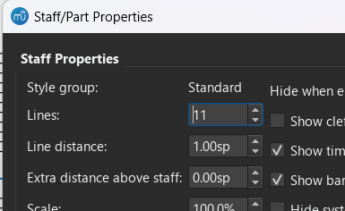

# Chromatic staff

Various templates for chromatic staff notation, where nominals are consistently the same interval.

For transpositions/custom clefs/multi-chromatic-staff, [change the reference pitch](../../README.md#6-change-reference-pitch).

The number of lines in a staff can be changed in the **Staff/Part Properties** dialog which is accessed by right-clicking a staff.

