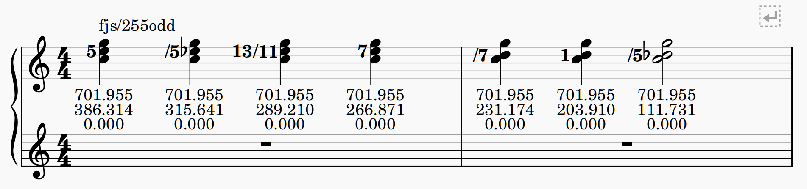

# Functional Just System

See [misotanni.github.io/fjs/en/](https://misotanni.github.io/fjs/en/)

### Disclaimer

The official FJS spec says that Pythagorean accidentals (sharp/natural/flat) will reset prior FJS commas/numeric accidentals, while Pyth accidentals are allowed to propagate through FJS commas within the bar.

As of the time of this writing, this plugin only supports either:

- Independent mode: Pyth accidentals propagate through FJS commas **and** FJS commas propagate through Pyth accidentals.

- Non-independent mode: Neither propagate through the other, so repeated pythagorean accidentals over different FJS commas will have to be respecified.