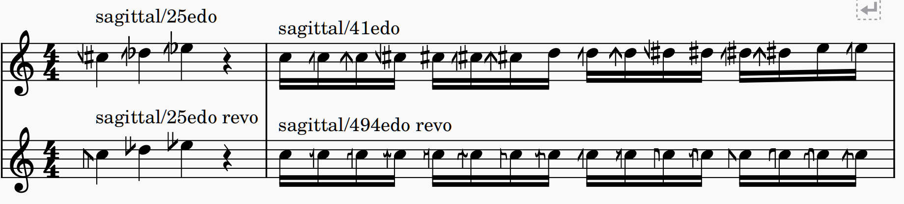

# [Sagittal Notation](https://sagittal.org/)

Access supported edos using System Text:

- `sagittal/___edo` for Evo variant (mixed pythagorean sharp/flat symbols and sagittal symbols).
- `sagittal/___edo revo` for Revo variant (pure sagittal symbols)

As of now, the [edo notation definitions](./edo_definitions.json) are taken from https://github.com/Sagittal/sagittal-system/blob/main/src/notations/edo/definitions.ts

[generate_edo.py](./generate_edo.py) uses the definitions to generate the Sagittal notation for defined edos.